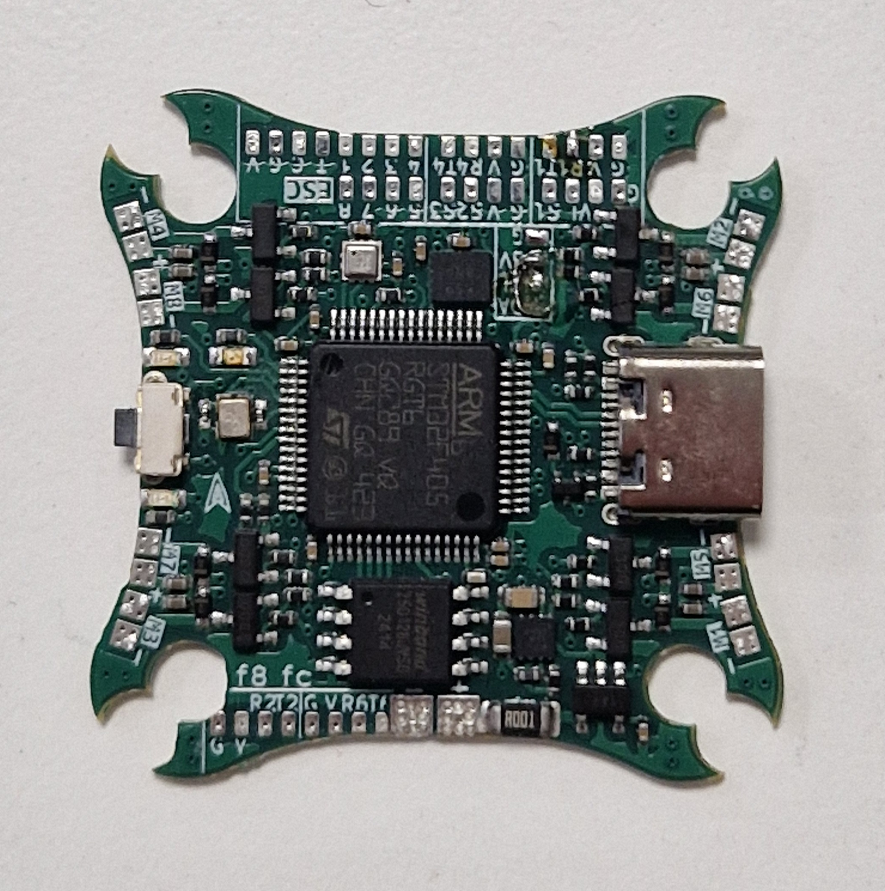

# f8 fc brushed x8 AIO

## Features
- STM32F405 microcontroller with 1MB flash
- BMI270 imu
- BMP388 barometer
- Onboard 16MB external flash for data logging
- Status LEDs
- 1-4s input voltage
- 4 available UARTs
- **8** brushed motor drives with 6A mosfets
- Voltage & current sensing
